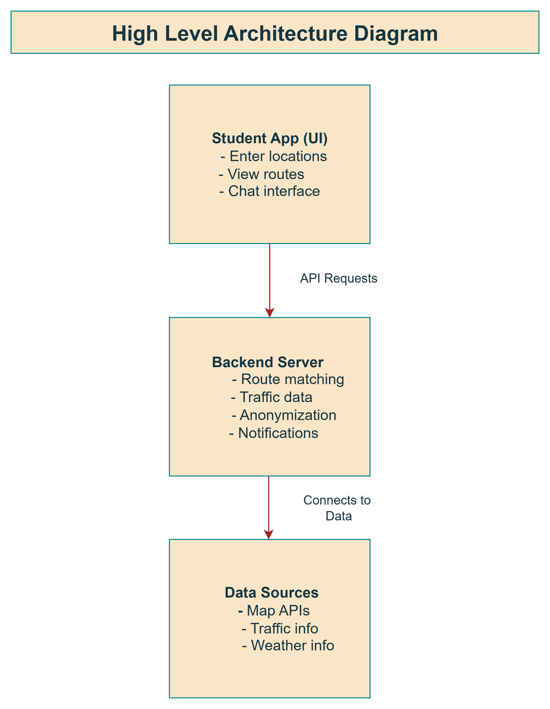

# 📘 Student Commute Optimizer

## 💡 Core Idea
The Student Commute Optimizer is a smart carpooling and route-sharing application designed specifically for students. It connects students traveling along similar paths, helping them share rides in an efficient, safe, and eco-friendly way. The system focuses on minimizing travel costs, reducing traffic congestion, and promoting sustainable commuting habits without compromising privacy.

## ✅ Solution

The solution consists of a student-friendly map interface where users input their start and end locations, view nearby students traveling along similar routes, and initiate chats with matched students under anonymized usernames. The backend processes route overlaps, traffic data, and user preferences to dynamically match students in real-time while ensuring data privacy. Additional features include eco-friendly routing suggestions, rerouting options in case of delays, and a gamification layer to encourage participation.

## High-level Architecture diagram

## ✅ Tech Stack

- **Frontend:** React.js with Tailwind CSS, OpenStreet Map API for visualization, WebSockets for real-time communication

- **Backend:** Node.js + Express.js, Python (for route optimization algorithms), Redis for caching frequent queries

- **Database:** MongoDB (for storing user data and pseudonyms securely)

- **Third-party APIs:** OpenStreet Map API(free), OpenWeather API, Traffic data providers

- **Authentication:** OAuth with anonymization layers  

## Potential Impact & Benefits

- Reduces commuting costs by facilitating shared rides

- ✅ Promotes environmental sustainability by reducing emissions and traffic

- ✅ Enhances student connectivity while preserving privacy

- ✅ Helps institutions manage traffic and transportation efficiently

- ✅ Encourages collaborative and conscious commuting habits

- ✅ Supports real-time adjustments during travel disruptions

## Uniqueness

- Anonymized pseudonym-based interactions ensure safety without compromising communication.

- Integrates eco-friendly routing options with gamified incentives.

- Dynamic rerouting and adaptive clustering offer real-time solutions, unlike static carpool systems.

- User preferences (quiet ride, music sharing) are factored into the match suggestions.
-Designed specifically for student communities with scalability options for cities and campuses.

## Why I Choose This

- Students often struggle with transportation expenses and safety concerns.

- Existing carpooling apps don’t focus on privacy, compatibility, or eco-conscious choices.

- Real-time traffic data and rerouting enhance usability.

- Encouraging sustainable commuting helps students take actionable steps toward reducing their carbon footprint.

- Gamification elements make the app engaging and encourage long-term adoption.

## Trade-offs Considered

| Aspect                  | Trade-off Decision            | Reasoning                                      |
|------------------------ |------------------------------ |----------------------------------------------- |
| Privacy vs Convenience  | Pseudonyms instead of real names | Maintains trust while allowing communication  |
| Accuracy vs Performance | Adjustable similarity thresholds | Balances match relevance with computation efficiency |
| Speed vs Battery Use   | Background updates every 5 minutes | Ensures freshness without excessive device consumption |
| Eco-routing vs Fastest Route | User can choose preference | Supports sustainability without forcing decisions |
| Feature complexity vs User adoption | Start simple, add features progressively | Prevents overwhelming users while scaling functionality |
